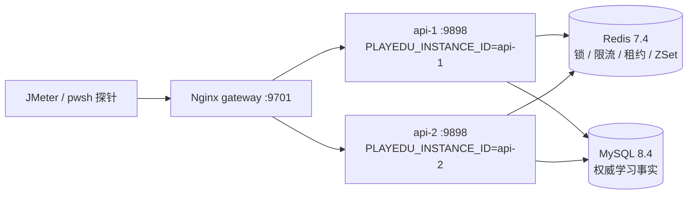

# Redis 多实例端到端验收

本目录描述 `10: 证明多实例行为并完成交付文档` 的可复现验收。验收入口是一个 Nginx 负载均衡器，后面固定挂载两个 API 实例；两个实例共用同一个 Redis 和 MySQL。

## 拓扑



`docker/acceptance/compose.yml` 使用独立的 Compose 项目名和 MySQL volume，不会复用根目录演示栈的数据。API 的 `X-PlayEdu-Instance` 响应头来自实例环境变量；网关额外返回 `X-PlayEdu-Upstream`，因此路由证据不依赖猜测容器日志。

## 前置条件

- Docker Desktop/Engine、Docker Compose v2 和 PowerShell 7（`pwsh`）。
- JMeter 5.6.3 可选；本地没有 `jmeter` 时，驱动器会使用 Compose 中固定的 `justb4/jmeter:5.5` 容器。
- 首次执行需要拉取 MySQL、Redis、Nginx、JMeter 和 Java 构建镜像，并编译 `playedu-api/Dockerfile`。

探针启用的 `/acceptance/v1/*` 接口只在 `PLAYEDU_ACCEPTANCE_ENABLED=true` 时注册。该开关只存在于验收 Compose 文件，生产环境不得打开。

## 启动、健康检查与停止

推荐由驱动器按顺序启动 API-1，再启动 API-2 和网关，避免两个实例同时执行首次数据库迁移：

```powershell
pwsh -NoProfile -File scripts/acceptance/run.ps1 -Action start
pwsh -NoProfile -File scripts/acceptance/run.ps1 -Action status
Invoke-RestMethod http://127.0.0.1:9701/actuator/health
```

启动过程会等待 API-1 健康、等待唯一索引迁移完成、灌入 `seed.sql` 中的确定性用户/课程/课时/历史榜单数据，并重建一次今天和昨天的榜单。

停止但保留 MySQL 数据：

```powershell
pwsh -NoProfile -File scripts/acceptance/run.ps1 -Action stop
```

如需从空数据库重新演示，可在确认不再需要验收数据后执行：

```powershell
docker compose --project-name playedu-redis-acceptance -f docker/acceptance/compose.yml down -v
```

## 验收场景与预期证据

运行完整验收：

```powershell
pwsh -NoProfile -File scripts/acceptance/run.ps1 -Action full
```

该命令依次执行 HTTP 探针、JMeter 非 GUI 计划和报告生成。JMeter 计划位于 `docker/acceptance/jmeter/multi-instance.jmx`，覆盖以下场景：

| 场景 | 入口 | 关键预期 |
| --- | --- | --- |
| 路由分布 | `/acceptance/v1/instance` | 响应头和响应体同时出现 `api-1`、`api-2` |
| 分布式锁 | `/acceptance/v1/lock` | 相同 subject 的两个并发请求只有一个 `entered=true`，另一个返回业务码 `42301` |
| 共享限流 | `/` | 24 个相同客户端 IP 请求共享 12 个/60 秒配额，出现预期 `429`；实例数不会把配额放大为 24 |
| 学习租约 | `/acceptance/v1/lease/*` | 首次 `CREATED` 不计时；另一课时 `CONFLICT`/`40901`；十秒后 `CONTINUED`；三十秒 TTL 后另一课时重新 `CREATED`；当前 session 才能 `STOPPED` |
| 排行榜查询 | `/acceptance/v1/ranking` | 查询今天和昨天两个 ZSet，记录 Redis 清空后的重建耗时 |

JMeter 结果写入被 `.gitignore` 忽略的 `.scratch/redis-distributed-learning/evidence/`：

- `multi-instance.jtl`：原始样本，包含响应数据和 `X-PlayEdu-Instance`/`X-PlayEdu-Upstream` 响应头。
- `jmeter.log`：JMeter 运行日志。
- `probe.json`：HTTP 探针的路由、锁、租约和清空 Redis 前后榜单证据。
- `multi-instance-report.md`：按场景计算请求数、吞吐量、HTTP 错误率、P95、P99、预期 429、实例集合和租约结果。

也可以分步执行：

```powershell
pwsh -NoProfile -File scripts/acceptance/run.ps1 -Action probe
pwsh -NoProfile -File scripts/acceptance/run.ps1 -Action load
pwsh -NoProfile -File scripts/acceptance/run.ps1 -Action report
```

## Redis 丢失与排行榜重建

锁、限流计数和学习租约是短期协调状态，不依赖 Redis 重启恢复。排行榜是 MySQL 的查询投影，可以手动清空并重建：

```powershell
docker compose --project-name playedu-redis-acceptance -f docker/acceptance/compose.yml exec -T redis redis-cli FLUSHDB
Invoke-RestMethod -Method Post -Uri http://127.0.0.1:9701/acceptance/v1/ranking/rebuild
Invoke-RestMethod -Uri http://127.0.0.1:9701/acceptance/v1/ranking
```

重建前后应比较 `probe.json` 中的 `ranking_before_redis_flush` 和 `ranking_after_redis_flush`；来源是相同的 MySQL 统计行，榜单成员、分值和排序应一致。业务 Dashboard 的受权限保护操作是 `/backend/v1/dashboard/learning-ranking/rebuild`，验收探针只是无认证的测试专用 seam，不替代生产接口。

## Redis 与 MySQL 的边界及故障策略

| 能力 | Redis | MySQL |
| --- | --- | --- |
| 分布式锁、请求令牌桶、登录失败计数、活跃学习租约 | 跨实例运行状态；故障时明确失败，不降级为本机状态 | 不保存这些短期协调状态 |
| 学习课时进度、课程进度、每日学习时长 | 不作为事实来源 | 单事务写入，按用户/自然日原子 UPSERT，唯一约束防重复统计 |
| 今天/昨天实时学习榜 | ZSet 查询投影，事务提交后异步更新，保留七天 | 重建唯一事实来源 |

启动阶段 Redis PING 失败时应用不进入可服务状态。运行期间锁、限流和租约会返回可重试的 `503` 或业务失败；排行榜投影失败不会回滚已提交学习事实，会记录结构化日志和指标，之后通过启动重建、自动缺失重建或权限保护的手动重建恢复。

## 完整交付验证

仓库级验证命令：

```powershell
cd playedu-api
.\mvnw.cmd spotless:check package
.\mvnw.cmd test
cd ..
cd playedu-admin; pnpm install; pnpm build; cd ..
cd playedu-pc; pnpm install; pnpm build; cd ..
cd playedu-h5; pnpm install; pnpm build; cd ..
```

`pnpm build` 包含 TypeScript 检查和 Vite 生产打包；Testcontainers 集成测试使用真实 Redis/MySQL，Docker 不可用时会按测试注解的约定跳过容器场景。每次实际运行后，将生成的报告和命令摘要附在交付记录中；不要用未执行的占位数值冒充吞吐量或延迟结果。
